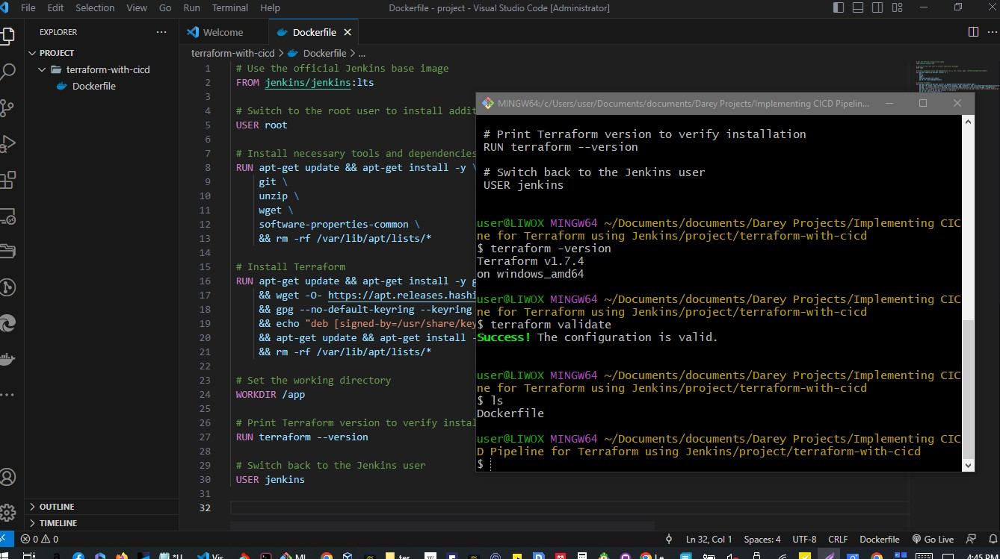

# Implementing CICD Pipeline for Terraform using Jenkins - *Armstrong*
### ***Introduction to CI/CD and its importance in software development***

---


Welcome to this comprehensive hands-on project on ***"Implementing CI/CD Pipeline for Terraform using Jenkins."*** 

In today's rapidly evolving IT landscape, efficient and reliable deployment of infrastructure is paramount. 

Continuous Integration and Continuous Deployment (CI/CD) have emerged as indispensable practices, fostering automation and agility in the software development lifecycle. 

In this project, we will explore the powerful combination of Terraform, a leading Infrastructure as Code (laC) tool, and Jenkins, a widely-used automation server, to streamline and enhance infrastructure deployment workflows.

### Project Overview:
In this hands-on project, we will delve into the intricacies of building a robust CI/CD pipeline specifically tailored for Terraform projects. 

By automating the building, testing, and deployment of infrastructure changes, these pipelines enhance speed, reliability, and consistency across environments. 

The use of Infrastructure as Code (laC) with Terraform ensures *reproducibility and scalability*, while Jenkins facilitates *collaborative development, visibility, and continuous integration and deployment*.

This approach not only reduces time-to-market but also promotes resource efficiency, cost optimization, and compliance with security standards. 

Overall, CI/CD pipelines with Terraform and Jenkins empower organizations to adapt quickly to changing business requirements, fostering a culture of automation and continuous improvement in the dynamic landscape of modern software development and operations.

---


### Setting Up the Environment

1. We will start the project by setting up a Jenkins server running in a docker container.

1. We will create a Dockerfile to define the configuration for our Jenkins server. 

This Dockerfile will include the necessary dependencies and configurations to run Jenkins seamlessly, and also to run terraform cli.

### Dockerfile for Jenkins

Jenkins comes with a docker image that can be used out of the box to run a container with all the relevant dependencies for Jenkins. 

But because we have unique requirement to run terraform, we need to find a way to extend the readily available jenkins image.

The Jenkins official docker image can be found here (https://hub.docker.com/_/jenkins/).

Extending this image means we have to write our own dockerfile, and include all the other stuff we need.

 
***Lets go through that quickly***.
1. Create a directory and name it 
```
terraform-with-cicd
```
2. create a file and name it 
```
Dockerfile
```
3. Add the below content in the dockerfile
```
 # Use the official Jenkins base image
 FROM jenkins/jenkins:lts

 # Switch to the root user to install additional packages
 USER root

 # Install necessary tools and dependencies (e.g., Git, unzip, wget, software-properties-common)
 RUN apt-get update && apt-get install -y \
     git \
     unzip \
     wget \
     software-properties-common \
     && rm -rf /var/lib/apt/lists/*

 # Install Terraform
 RUN apt-get update && apt-get install -y gnupg software-properties-common wget \
     && wget -O- https://apt.releases.hashicorp.com/gpg | gpg --dearmor | tee /usr/share/keyrings/hashicorp-archive-keyring.gpg \
     && gpg --no-default-keyring --keyring /usr/share/keyrings/hashicorp-archive-keyring.gpg --fingerprint \
     && echo "deb [signed-by=/usr/share/keyrings/hashicorp-archive-keyring.gpg] https://apt.releases.hashicorp.com $(lsb_release -cs) main" | tee /etc/apt/sources.list.d/hashicorp.list \
     && apt-get update && apt-get install -y terraform \
     && rm -rf /var/lib/apt/lists/*

 # Set the working directory
 WORKDIR /app

 # Print Terraform version to verify installation
 RUN terraform --version

 # Switch back to the Jenkins user
 USER jenkins

```


---
---

---
---

# Let us Explain the dockerfile

lets go through that Dockerfile to understand what is going on step by step, then we proceed to building our custom jenkins image for terraform.

1. 
```
FROM jenkins/jenkins:lts
```
Use the official Jenkins base image.

This line specifies the base image for your Dockerfile. 

In this case, it's using the official Jenkins LTS (Long Term Support) image as a starting point.

2. 
```
USER root
```
Switch to the root user to install additional packages.

This command switches to the root user within the Docker image. 

This is done to perform actions that require elevated permissions, such as installing packages.

3. 
```
RUN apt-get update && apt-get install -y \
    git \
    unzip \
    wget \
    software-properties-common \
    && rm -rf /var/lib/apt/lists/*
```
Install necessary tools and dependencies (e.g., Git, unzip, wget, software-properties-common).

This section installs various tools and dependencies needed for the image. 

The apt-get update command refreshes the package list, and apt-get install installs the specified packages *(git, unzip, wget, software-properties-common)*.

The *&&* is used to chain commands, and *rm -rf /var/lib/apt/lists/** removes unnecessary package lists, helping to reduce the size of the Docker image.

4. 
```
RUN apt-get update && apt-get install -y gnupg software-properties-common wget \
    && wget -O- https://apt.releases.hashicorp.com/gpg | gpg --dearmor | tee /usr/share/keyrings/hashicorp-archive-keyring.gpg \
    && gpg --no-default-keyring --keyring /usr/share/keyrings/hashicorp-archive-keyring.gpg --fingerprint \
    && echo "deb [signed-by=/usr/share/keyrings/hashicorp-archive-keyring.gpg] https://apt.releases.hashicorp.com $(lsb_release -cs) main" | tee /etc/apt/sources.list.d/hashicorp.list \
    && apt-get update && apt-get install -y terraform \
    && rm -rf /var/lib/apt/lists/*
```
This block installs Terraform. 

It follows similar steps as before: updating the package list, installing dependencies, adding HashiCorp's GPG key, configuring the repository, updating again, and finally installing Terraform.

Again, it includes cleaning up unnecessary package lists.

>A quick note on GPG Key: GPG (GNU Privacy Guard) is a free and open-source software for encrypting and signing data. In the context of software distribution, GPG keys are used to verify the integrity and authenticity of packages.

5. 
```
WORKDIR /app
```
Set the working directory.

this command sets the working directory to /app for subsequent commands. 

We will arrive here when we enter the container.

6. 
```
RUN terraform --version
```
This command prints the version of terraform to the console. This will verify is the installation was successful.

7. 
```
USER jenkins
```
This line Switches back to jekens user which is at a lower previlege level.

---
---


# Building and running the docker image

Our mission right now is to have a docker container running Jenkins, but also have terraform installed.

Next is to build the docker image, and run it for further configuration.

We should Make sure that we are inside the folder containing the Dockerfile . 

This is generally referred to as the Docker Build Context . 

The build context is the set of files located in the specified directory or path when you build a Docker image using the docker build command. 

The content of the build context is sent to the Docker daemon during the build process, and it serves as the source for building the Docker image.

1. Build the custom jenkins image

```
docker build -t jenkins-server . 
```
the harsh dat looks like this ```800f8f48466b3419d7cbf37908b12f146120b31260147bdd3b433d23e60f976b```

2. 
```
docker run -d -p 8080:8080 --name jenkins-server jenkins-server 
```
Run the image into a docker container.

3. 

```
docker ps
```

4. 

Access the jenkens server from a web browser on ```localhost:8000```

---


